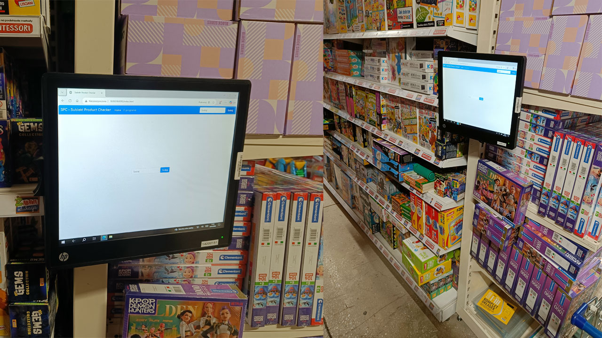
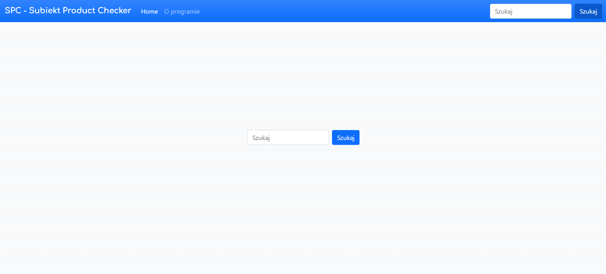
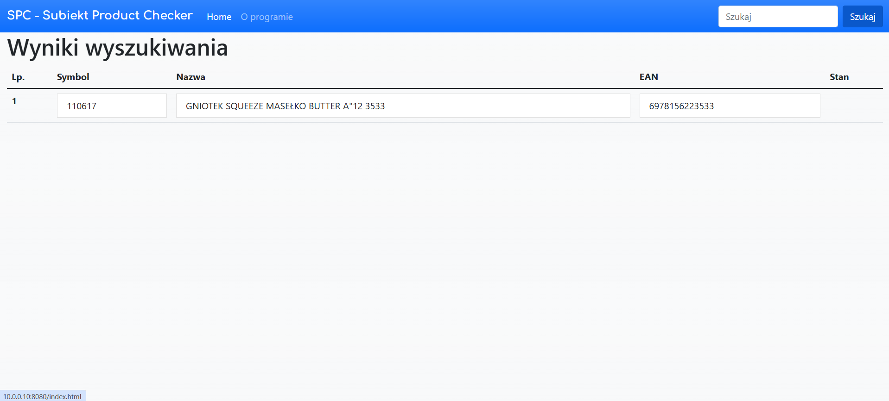
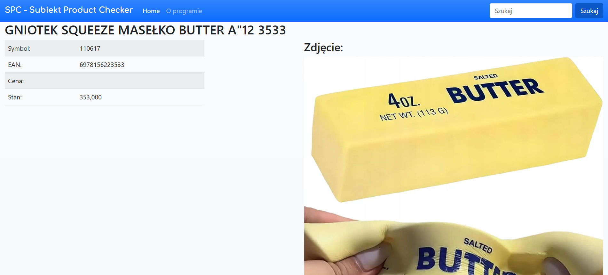
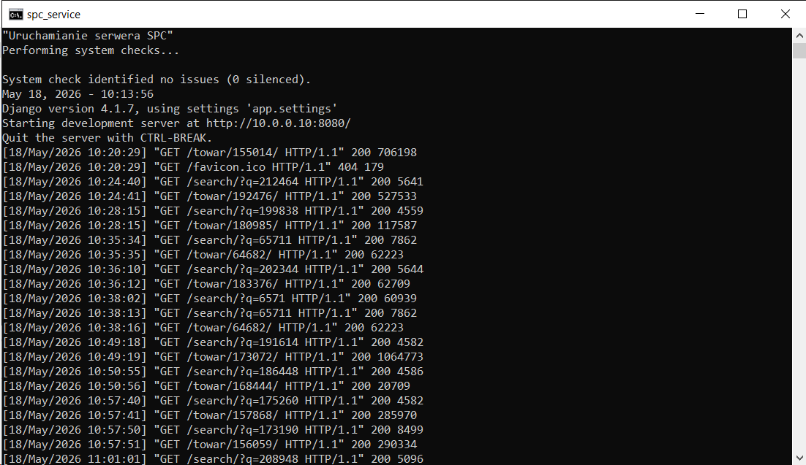

# Subiekt Product Checker (SPC)

A Django web application deployed in a production warehouse environment, 
built to integrate with the Subiekt GT ERP system (Insert GT package).

## 🎯 Problem solved

Warehouse staff picking orders had no quick way to visually identify products.
SubiektGT has no tool to display simple and necessary details about goods in DB.
There was the only way to install a full PC set with SubiektGT. The was no need for that and there was no place
between warehouse shelves. This tool lets them look up any item by name or code and instantly see 
its photo — displayed on a dedicated touchscreen terminal on the warehouse shelve.

## ⚙️ How it works

- Connects directly to **MS SQL Server** via **ODBC** (pyodbc)
- Reads product data and images stored as **base64** in the Subiekt GT database
- Decodes and renders images on the fly — no separate image storage needed
- Served via Django on a local network; Currently deployed on a **Lenovo SFF** (i3-4130T, 4GB RAM, 120 GB SSD)
  with 17" touchscreen HP L6017tm (also tested on AWS EC2) - it will work on most devices

#### Screens
- Ready-To-Work

- Main View

- Search result

- Item details

- spc_service Console

## 🛠 Tech stack

- Python 3 / Django
- MS SQL Server (Subiekt GT database)
- pyodbc / ODBC connection
- Bootstrap 5
- SQLite3 (local session/config data)

## 📁 Key files

| File | Description |
|------|-------------|
| `SPC.sql` | SQL view/query used to fetch product + image data from Subiekt GT |
| `zdjecie.py` | Base64 image decoding logic |
| `tabele.py` | MS SQL table mapping helpers |
| `spc_service.bat` | Windows batch script to run as a background service |

## 🚀 Setup

1. Configure your ODBC connection to MS SQL Server in `settings.py`
2. Run `pip install -r requirements.txt`
3. Run `python manage.py runserver 0.0.0.0:8000`
4. Access from any device on the local network

> **Note:** Requires access to a Subiekt GT MS SQL database. 
> Not compatible with Subiekt nexo (different schema).

## 📌 Status

Deployed and in active use since 2023.
